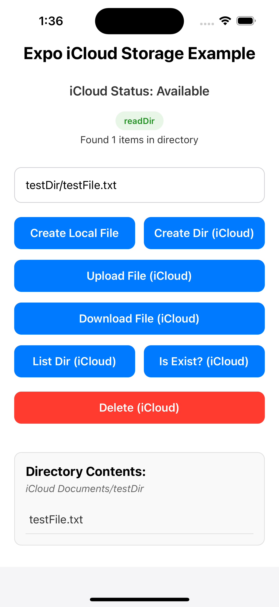

# Expo iCloud Storage

[](https://www.npmjs.com/package/@oleg_svetlichnyi/expo-icloud-storage)
[](https://www.npmjs.com/package/@oleg_svetlichnyi/expo-icloud-storage)
[](LICENSE)

Typed iCloud Drive file API for Expo iOS apps.

Use it to upload, download, list, delete, and build backup flows for SQLite, Realm, documents, exports, and media without writing native iOS code.

- Docs: https://o-svetlichnyi.github.io/expo-icloud-storage/
- npm: https://www.npmjs.com/package/@oleg_svetlichnyi/expo-icloud-storage
- Issues: https://github.com/o-svetlichnyi/expo-icloud-storage/issues

## Features

- iOS-only Expo Module for iCloud Drive file operations.
- Works with Expo SDK 53+ in development builds, EAS builds, prebuild, and bare React Native apps using Expo Modules.
- Config plugin for iCloud entitlements and `NSUbiquitousContainers`.
- Typed API with TypeScript definitions.
- Upload and download progress listeners.
- Example app included in `example/`.

This module does not run in Expo Go because it includes native iOS code.

## Install

```bash
npm install @oleg_svetlichnyi/expo-icloud-storage
```

## Configure iCloud

Add the config plugin to `app.json` or `app.config.js`:

```json
{
  "expo": {
    "plugins": [
      [
        "@oleg_svetlichnyi/expo-icloud-storage",
        {
          "containerIdentifier": "iCloud.$(CFBundleIdentifier)",
          "containerName": "$(PRODUCT_NAME)"
        }
      ]
    ]
  }
}
```

Then build an iOS development build, EAS build, prebuild, or bare iOS app. The user must be signed in to iCloud and iCloud Drive must be enabled on the device.

Full setup guide: https://o-svetlichnyi.github.io/expo-icloud-storage/getting-started

## Quick Start

```ts
import * as FileSystem from "expo-file-system/legacy";
import {
  createDirAsync,
  defaultICloudContainerPath,
  downloadFileAsync,
  isICloudAvailableAsync,
  readDirAsync,
  unlinkAsync,
  uploadFileAsync,
} from "@oleg_svetlichnyi/expo-icloud-storage";

export async function roundTripExportFile() {
  const available = await isICloudAvailableAsync();

  if (!available || !defaultICloudContainerPath) {
    throw new Error("iCloud is not available for this app/user.");
  }

  const localFile = `${FileSystem.documentDirectory}export.json`;
  const downloadDir = `${FileSystem.documentDirectory}downloads`;
  const remoteDirectory = "Exports";
  const remoteRelativePath = `${remoteDirectory}/export.json`;
  const remoteFullPath = `${defaultICloudContainerPath}/Documents/${remoteRelativePath}`;

  await FileSystem.writeAsStringAsync(localFile, JSON.stringify({ ok: true }));
  await FileSystem.makeDirectoryAsync(downloadDir, { intermediates: true });
  await createDirAsync(remoteDirectory);

  await uploadFileAsync({
    destinationPath: remoteRelativePath,
    filePath: localFile,
  });

  const files = await readDirAsync(remoteDirectory, { isFullPath: false });
  const downloadedPath = await downloadFileAsync(remoteFullPath, downloadDir);

  await unlinkAsync(remoteFullPath);

  return { files, downloadedPath };
}
```

Path rule: `createDirAsync`, `readDirAsync`, `isExistAsync`, `uploadFileAsync`, and `uploadFilesAsync` use paths relative to iCloud `Documents`. `downloadFileAsync`, `downloadFilesAsync`, and `unlinkAsync` use full iCloud source paths; download destination directories can be Expo FileSystem `file://` URIs or plain local paths.

Read the full quick start: https://o-svetlichnyi.github.io/expo-icloud-storage/quick-start

## API

| Export | Purpose |
| --- | --- |
| `defaultICloudContainerPath` | Absolute path to the app's iCloud container, or `null` when unavailable. |
| `isICloudAvailableAsync()` | Checks whether iCloud is available for the current user/device. |
| `createDirAsync(path)` | Creates a directory under iCloud `Documents`. |
| `readDirAsync(path, options)` | Lists a directory under iCloud `Documents`. |
| `isExistAsync(path, isDirectory)` | Checks whether a file or directory exists under iCloud `Documents`. |
| `uploadFileAsync(options)` | Uploads one local file to iCloud `Documents`. |
| `uploadFilesAsync(options)` | Uploads multiple local files to an iCloud directory. |
| `downloadFileAsync(path, destinationDir)` | Downloads a full iCloud file path to a local directory. |
| `downloadFilesAsync(paths, destinationDir)` | Downloads multiple full iCloud file paths. |
| `unlinkAsync(path)` | Deletes a full iCloud path. |
| `addUploadFilesAsyncProgressListener(listener)` | Listens for upload progress. |
| `addDownloadFilesAsyncProgressListener(listener)` | Listens for download progress. |
| `PathUtils` | Helpers for `.icloud` placeholder paths and extensions. |

Full API reference: https://o-svetlichnyi.github.io/expo-icloud-storage/api

## Recipes

- SQLite backup and restore: https://o-svetlichnyi.github.io/expo-icloud-storage/recipes/sqlite-backup
- Realm backup and restore: https://o-svetlichnyi.github.io/expo-icloud-storage/recipes/realm-backup

## Example App

A full Expo example app is included in `example/`.

```bash
npm install
npm run prepare

cd example
npm install
npm run ios
```



## Development

```bash
npm run build
npm run lint
npm run test
npm run docs:build
```

## License

[MIT](LICENSE) © 2024-present Oleg Svetlichnyi
