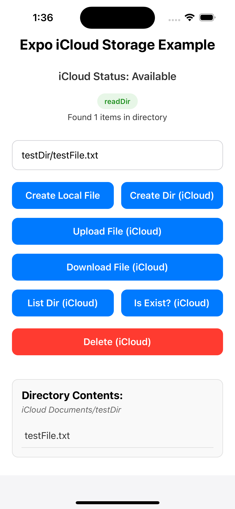

# Expo iCloud Storage

A lightweight Expo module that provides a **typed JavaScript API** for interacting with a user's iCloud Drive.  
Use it to **upload / download files**, **create directories**, **check file existence**, and **listen for real-time progress events** – all without leaving the JavaScript world.

---

## ✨ Features

- Works in **managed** and **bare** Expo or React Native projects (iOS 13+).
- Promise-based API with TypeScript definitions out of the box.
- Granular progress callbacks for batch **upload** and **download** operations.
- Utility helpers for common path manipulations.

---

## 📦 Installation

```bash
# with npm
yarn add @oleg_svetlichnyi/expo-icloud-storage
# or npm
npm install @oleg_svetlichnyi/expo-icloud-storage --save
```

### Expo managed workflow
Nothing else to do – the module will be autolinked at build time by the Expo SDK.

### Bare React Native / Expo modules workflow
Ensure you have configured the [Expo Modules API](https://docs.expo.dev/bare/installing-expo-modules/) in your iOS project, then run `pod install` inside the `ios` directory.

> 🚨 **iCloud capability** – Open Xcode, select your target, _Signing & Capabilities_ → add **iCloud** with "iCloud Drive" checked.

---

## 🍏 iOS configuration (app.json / app.config.js)

Expo needs the proper iCloud entitlements.  
Add **usesIcloudStorage** and a **NSUbiquitousContainers** entry inside `ios.infoPlist`:

```jsonc
{
  "expo": {
    "ios": {
      "infoPlist": {
        "NSUbiquitousContainers": {
          "iCloud.$(CFBundleIdentifier)": {
            "NSUbiquitousContainerIsDocumentScopePublic": false,
            "NSUbiquitousContainerName": "$(PRODUCT_NAME)",
            "NSUbiquitousContainerSupportedFolderLevels": "Any"
          }
        }
      }
    }
  }
}
```

> Replace the container identifier if you created a custom one in the Apple Developer portal.

---

## 🚀 Example

The snippet below brings together **every** export of the library so you can see them in action. It backs up a local SQLite DB to iCloud and restores it back.

```ts
import {
  defaultICloudContainerPath,
  isICloudAvailableAsync,
  createDirAsync,
  isExistAsync,
  readDirAsync,
  uploadFilesAsync,
  unlinkAsync,
  uploadFileAsync,
  downloadFileAsync,
  downloadFilesAsync,
  PathUtils,
  addUploadFilesAsyncProgressListener,
  addDownloadFilesAsyncProgressListener,
} from '@oleg_svetlichnyi/expo-icloud-storage';
import * as FileSystem from 'expo-file-system';

async function backupDatabase() {
  if (!(await isICloudAvailableAsync())) {
    console.warn('iCloud unavailable');
    return;
  }

  const containerDocs = `${defaultICloudContainerPath}/Documents`;
  const sqlDir = `${containerDocs}/SQL`;

  // Make sure destination folder exists
  if (!(await isExistAsync(sqlDir, true))) {
    await createDirAsync('SQL');
  }

  // Upload current DB file
  await uploadFileAsync({
    destinationPath: 'SQL/app-backup.db',
    filePath: FileSystem.documentDirectory + 'SQLite/app.db',
  });
}

async function listBackups() {
  const files = await readDirAsync('SQL');
  console.log('All backups', files);
}

async function restoreLatest() {
  const files = await readDirAsync('SQL', { isFullPath: false });
  if (!files.length) return;

  // take the first one (latest by your own sorting)
  const latest = files[0];
  const downloadPath = await downloadFileAsync(
    `${defaultICloudContainerPath}/Documents/SQL/${latest}`,
    FileSystem.documentDirectory + 'SQLite'
  );
  console.log('Restored to', downloadPath);
}

// Listen to progress when uploading multiple files
const sub = addUploadFilesAsyncProgressListener(({ value }) => console.log('Progress', value));

// Later → sub.remove();
```

### Running the Example App

A full example Expo application is included in the `example` directory. To run it:

1. **Build the module first:**
   ```bash
   # From the root directory
   npm run prepare
   ```

2. **Run the example:**
   ```bash
   cd example
   npm install
   npm run ios
   ```

The example app demonstrates all the module's features with a simple UI.



---

## 🔌 API Reference

| Method | Signature | Description |
| ------ | --------- | ----------- |
| `defaultICloudContainerPath` | `string \| null` | Absolute path to the app's iCloud container. `null` if iCloud is disabled. |
| `isICloudAvailableAsync()` | `Promise<boolean>` | Detect whether the user is signed in to iCloud and the capability is enabled. |
| `isExistAsync(path, isDirectory)` | `Promise<boolean>` | Check if a file **or directory** exists inside the container. |
| `createDirAsync(path)` | `Promise<void>` | Recursively create a folder inside iCloud Drive. |
| `readDirAsync(path, { isFullPath? })` | `Promise<string[]>` | List directory contents. When `isFullPath` is `false` only file names are returned. |
| `uploadFileAsync({ destinationPath, filePath })` | `Promise<void>` | Upload a single local file (`file://…`) to iCloud. |
| `uploadFilesAsync({ destinationDirectory, filePaths })` | `Promise<void>` | Upload **multiple** files to the given directory. Progress events are emitted (see below). |
| `downloadFileAsync(path, destinationDir)` | `Promise<string>` | Download a remote file; resolves with the **local** path once copied. |
| `downloadFilesAsync(paths, destinationDir)` | `Promise<Array<{ success: boolean; path: string }>>` | Download an array of iCloud file paths at once. Emits progress events and returns the result for every file. |
| `unlinkAsync(path)` | `Promise<void>` | Permanently remove a file or folder from iCloud Drive. |

### Events

```ts
import {
  addUploadFilesAsyncProgressListener,
  addDownloadFilesAsyncProgressListener,
} from '@oleg_svetlichnyi/expo-icloud-storage';

// value is a Double between 0 – 100
const sub = addUploadFilesAsyncProgressListener(({ value }) => {
  console.log('Upload progress', value);
});

// Remember to unsubscribe
sub.remove();
```

| Event listener | Emitted from | Payload |
| -------------- | ------------ | ------- |
| `addUploadFilesAsyncProgressListener` | `uploadFile(s)Async` | `{ value: number }` percentage |
| `addDownloadFilesAsyncProgressListener` | `downloadFile(s)Async` | `{ value: number }` percentage |

### Path utilities

```ts
import { PathUtils } from '@oleg_svetlichnyi/expo-icloud-storage';

PathUtils.ext('file.jpg.icloud');          // 'icloud' (last segment)
PathUtils.iCloudRemoveDotExt('photo.heic.icloud'); // 'photo.heic'
```

---

## 📄 License

[MIT](LICENSE) © 2024 — based on Expo Modules SDK
