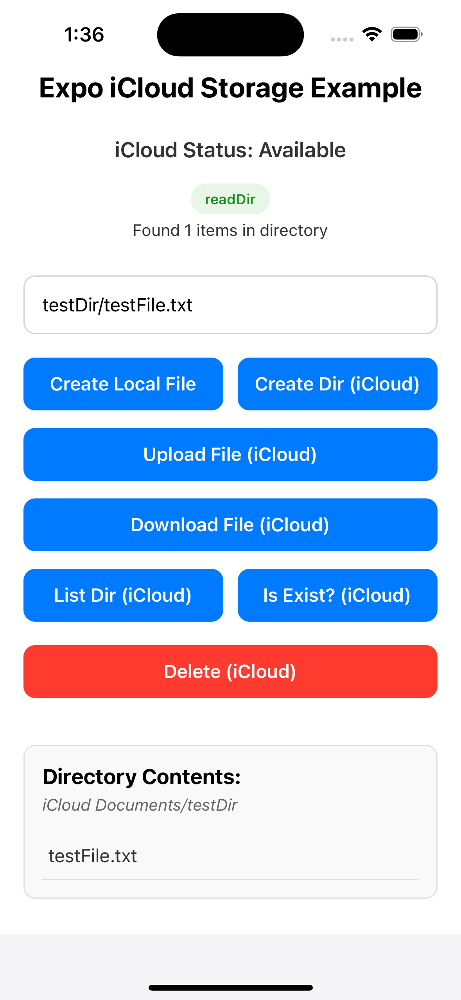

# Expo iCloud Storage Example

This example demonstrates how to use the `@oleg_svetlichnyi/expo-icloud-storage` module in an Expo application for iOS iCloud storage operations.

## Screenshot



## Features

- Create local files
- Upload files to iCloud
- Download files from iCloud
- Create directories in iCloud
- List directory contents in iCloud
- Check if files/directories exist in iCloud
- Delete files/directories from iCloud

## Setup & Running

1. **Build the module first:**
   
   From the root directory (parent of this example directory):
   ```
   npm run prepare
   ```
   This step is crucial as it builds the module that the example depends on.

2. **Install dependencies for the example:**

   ```
   cd example
   npm install
   ```

3. **Run the iOS simulator:**

   ```
   npm run ios
   ```

## Important Notes

- This module only works on iOS devices and simulators.
- For real device testing, make sure the app has proper entitlements for iCloud access.
- The app uses the default iCloud container. In a production app, you would configure a specific iCloud container in your app's entitlements.

## Troubleshooting

- If you see uploads or downloads hanging, make sure the target directories exist.
- If iCloud is not available, check that you're signed into an iCloud account in the simulator/device.
- For changes to the native module, remember to rebuild using `npm run prepare` from the root directory.

## License

See the LICENSE file in the root directory for details. 